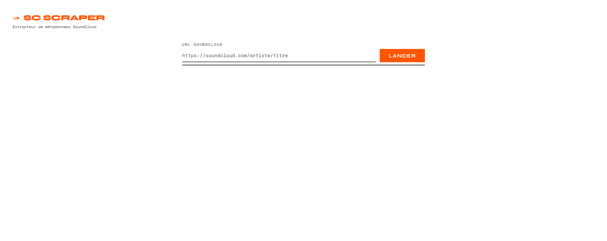
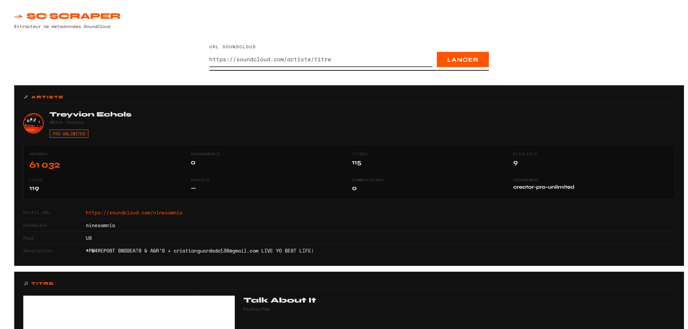

# SC Scraper

Outil d'extraction de métadonnées SoundCloud et de téléchargement audio, déployable sur n'importe quel serveur PHP disposant de FFmpeg.

---

## Table des matières

1. [Présentation générale](#1-présentation-générale)
2. [Fonctionnalités](#2-fonctionnalités)
3. [Prérequis](#3-prérequis)
4. [Installation](#4-installation)
5. [Structure du projet](#5-structure-du-projet)
6. [Utilisation](#6-utilisation)
7. [Architecture technique](#7-architecture-technique)
8. [Flux de téléchargement audio](#8-flux-de-téléchargement-audio)
9. [Paramètres et configuration](#9-paramètres-et-configuration)
10. [Dépannage](#10-dépannage)
11. [Limitations connues](#11-limitations-connues)
12. [Licence](#12-licence)

---

## 1. Présentation générale

SC Scraper est un petit outil léger composée de trois fichiers PHP et d'une interface HTML/JavaScript. Il permet d'interroger une page SoundCloud à partir de son URL publique, d'en extraire les métadonnées structurées (artiste, titre, statistiques, flux audio disponibles), puis de télécharger le fichier audio directement depuis le navigateur.

L'application fonctionne entièrement côté serveur pour les requêtes réseaux (résolution des flux...), et côté client pour l'assemblage des segments audio et la génération du fichier téléchargeable.




---

## 2. Fonctionnalités

**Extraction de métadonnées**

L'outil récupère l'intégralité des données publiques. Ce sont :

- Les informations sur l'artiste : nom, identifiant, nombre d'abonnés, abonnements, titres publiés, playlists, likes, reposts, commentaires, statut de vérification, badges de souscription, avatar et bannière.
- Les métadonnées du titre : nom, genre, description, durée, date de sortie, label, statistiques d'écoute et de téléchargement, URL de la pochette et de la forme d'onde.
- Les métadonnées d'éditeur lorsqu'elles sont renseignées : artiste, album, titre de release, code ISRC, code UPC/EAN, lignes de copyright P et C.
- La liste des flux audio disponibles avec leur format, protocole, qualité et URL de résolution.

**Téléchargement audio**

Une fois les flux récupérés, l'application vérifie leur disponibilité effective via un proxy PHP. Pour chaque flux valide, un bouton de téléchargement est proposé. Le téléchargement se déroule entièrement dans le navigateur : les segments HLS sont récupérés un à un, assemblés en mémoire, puis proposés au téléchargement sous forme de blob binaire au format `m4a` ou `opus`.

Un mode alternatif via FFmpeg est également disponible (`telechargement.php`) pour les serveurs souhaitant gérer l'assemblage côté serveur.

---

## 3. Prérequis

**Côté serveur**

- PHP 7.4 minimum (PHP 8.x recommandé)
- L'extension `php-curl` ou, à défaut, `allow_url_fopen = On` dans `php.ini` (utilisé par `file_get_contents` avec contexte HTTP)
- FFmpeg installé et accessible dans le `PATH` du système, uniquement si vous utilisez `telechargement.php`
- Un serveur web Apache, Nginx ou équivalent avec support PHP

**Côté client**

- Un navigateur moderne supportant l'API `Fetch`, `Blob` et `URL.createObjectURL` (Chrome 60+, Firefox 58+, Safari 12+, Edge 79+)
- Aucune dépendance JavaScript externe à installer : Tailwind CSS est chargé via CDN, les polices via Google Fonts

**Permissions système**

- Le dossier `MP3/` doit être créable par le processus PHP (droits d'écriture sur le répertoire racine du projet)
- Le répertoire temporaire système (`sys_get_temp_dir()`) doit être accessible en écriture pour `telechargement.php`

---

## 4. Installation

### Étape 1 — Cloner le dépôt

```bash
git clone https://github.com/dibikre/sc-scraper.git
cd sc-scraper
```

### Étape 2 — Déployer les fichiers sur le serveur

En local pour demarrer vous essayez:
```bash
php -S localhost:4000
```

Sinon sur un serveur, Copiez les trois fichiers à la racine de votre répertoire web (par exemple `/var/www/html/sc-scraper/` sous Apache, ou le dossier `public/` de votre hébergeur) :

```
index.php
sc.php
telechargement.php
```

Il n'y a aucune dépendance à installer via Composer ou npm. Le projet est intentionnellement sans gestionnaire de dépendances.

### Étape 3 — Vérifier les permissions

```bash
# Le dossier MP3/ sera créé automatiquement, mais PHP doit pouvoir écrire ici
chmod 755 /var/www/html/sc-scraper/
```

### Étape 4 — Vérifier la présence de FFmpeg (facultatif)

FFmpeg n'est nécessaire que si vous souhaitez utiliser `telechargement.php`. Pour vérifier son installation :

```bash
ffmpeg -version
```

Si FFmpeg n'est pas installé et que vous ne comptez pas utiliser `telechargement.php`, l'application fonctionnera normalement sans lui. Le téléchargement audio côté client (via `index.php`) ne dépend pas de FFmpeg.

### Étape 5 — Tester l'installation

Ouvrez `index.php` dans votre navigateur. Si la page s'affiche correctement avec la barre de recherche, l'installation est réussie.

---

## 5. Structure du projet

```
sc-scraper/
│
├── index.php              Page principale : interface utilisateur et logique
│                          de téléchargement côté client
│
├── sc.php                 Backend PHP : scraping SoundCloud, extraction des
│                          métadonnées, proxy pour la résolution des flux audio
│
├── telechargement.php     Endpoint de téléchargement côté serveur : assemblage
│                          des segments HLS via FFmpeg
│
└── MP3/                 Dossier créé automatiquement pour la sauvegarde
                           silencieuse des données extraites au format JSON
```

### Rôle de chaque fichier en détail

**`index.php`**

C'est le point d'entrée de l'application. Il contient l'intégralité de l'interface (HTML, CSS via balises `<style>`, JavaScript via balises `<script>`). Aucun fichier CSS ou JS externe n'est nécessaire en dehors des CDN. Ce fichier ne fait aucun traitement PHP : il se contente de servir la page statique.

**`sc.php`**

C'est le cerveau de l'application. Il expose trois actions :

- Sans paramètre `action` : scraping d'une URL SoundCloud passée en `?url=`.
- `?action=check_streams` : vérifie la disponibilité de plusieurs flux audio en interrogeant l'API SoundCloud depuis le serveur. Renvoie la liste des flux valides avec leur URL M3U8 résolue.
- `?action=resolve_stream` : résout l'URL d'un flux unique. Action utilisable indépendamment.

**`telechargement.php`**

Reçoit une URL de playlist M3U8, un nom de fichier et un jeton d'authentification optionnel. Lance FFmpeg en sous-processus pour assembler les segments HLS en un fichier audio, puis envoie le fichier résultant directement au navigateur via les en-têtes HTTP appropriés (`Content-Disposition: attachment`).

---

## 6. Utilisation

### Extraire les métadonnées d'un titre

1. Ouvrez l'application dans votre navigateur.
2. Collez l'URL complète d'un titre SoundCloud dans le champ de saisie. Par exemple : `https://soundcloud.com/nom-artiste/nom-titre`
3. Appuyez sur Entrée ou cliquez sur le bouton **LANCER**.
4. L'application affiche une barre de progression animée pendant la récupération, puis affiche les résultats structurés en cartes.



### Télécharger un titre

1. Une fois les résultats affichés, faites défiler jusqu'à la section **Audio**.
2. Cliquez sur le bouton **TÉLÉCHARGER** pour afficher la liste des qualités disponibles.
3. L'application vérifie automatiquement quels flux sont effectivement accessibles (cette vérification peut prendre quelques secondes).
4. Pour chaque flux disponible, un badge indique le format (`mp3_0_1`, `aac_1_0`, `opus_0_1`, etc.), le protocole (`HLS` ou `progressive`) et le niveau de chiffrement.
5. Cliquez sur le bouton correspondant à la qualité souhaitée. Une barre de progression par segment s'affiche pendant l'assemblage.
6. Une fois tous les segments récupérés, le téléchargement du fichier final se déclenche automatiquement dans le navigateur.

### Extraire les métadonnées d'un profil artiste

L'application fonctionne aussi sur les pages de profil artiste. Collez l'URL du profil (par exemple `https://soundcloud.com/nom-artiste`) et lancez la recherche. Seule la carte **Artiste** sera affichée, sans carte **Titre** ni section **Audio**.

---

## 7. Architecture technique

### Cycle de vie d'une requête de scraping

```
Navigateur                        Serveur PHP (sc.php)              SoundCloud
    |                                     |                               |
    |-- GET sc.php?url=<url_sc> --------->|                               |
    |                                     |-- GET <url_sc> (HTTP) ------->|
    |                                     |<-- HTML source page ----------|
    |                                     |                               |
    |                                     | Extraction
    |                                     | Parsing JSON
    |                                     | Structuration des données
    |                                     |                               |
    |<-- JSON { success, data } ----------|                               |
    |                                     |                               |
    | Rendu HTML des cartes de résultats  |                               |
```

### Cycle de vie d'un téléchargement audio

```
Navigateur                        Serveur PHP (sc.php)              API SoundCloud
    |                                     |                               |
    | [Clic "TÉLÉCHARGER"]                |                               |
    |                                     |                               |
    |-- GET sc.php?action=check_streams ->|                               |
    |   &streams=[{index,url}...]         |-- GET stream_url?client_id=  ->|
    |   &client_id=...                    |<-- { url: "https://..." } ----|
    |   &track_authorization=...         |                               |
    |<-- { valid: [{index, url, ...}] } --|                               |
    |                                     |                               |
    | [Pour chaque segment HLS]           |                               |
    |-- GET segment.m4s ------------------------------------------------->|
    |<-- données binaires -------------------------------------------------|
    |                                     |                               |
    | Assemblage en mémoire (Blob)        |                               |
    | Déclenchement du téléchargement     |                               |
```

### Pourquoi les segments HLS sont-ils téléchargés directement par le navigateur ?

Les segments audio eux-mêmes (`*.m4s`, `*.ts`) sont servis depuis les CDN de SoundCloud sans restriction particulière. Il est donc plus efficace de les récupérer directement depuis le navigateur, ce qui évite de faire transiter de grandes quantités de données binaires par le serveur PHP.

---

## 8. Flux de téléchargement audio

### Format des flux SoundCloud

SoundCloud distribue ses fichiers audio via le protocole HLS (HTTP Live Streaming). Chaque flux est décrit par une playlist au format M3U8, laquelle référence une séquence de segments binaires. Les formats généralement disponibles sont :

| Identifiant preset | Format audio | Protocole | Qualité |
|--------------------|--------------|-----------|---------|
| `mp3_0_1`          | MP3          | HLS       | Standard |
| `aac_1_0`          | AAC/M4A      | HLS       | Standard |
| `opus_0_1`         | Opus         | HLS       | Standard |
| `mp3_1_0`          | MP3          | HLS       | Haute qualité |

Certains flux peuvent être chiffrés (SAMPLE-AES). Le badge **CHIFFRÉ** est affiché dans l'interface lorsque c'est le cas. Ces flux restent téléchargeables mais leur déchiffrement est géré par FFmpeg dans le mode serveur (`telechargement.php`) ; le mode client peut ne pas les supporter selon le navigateur.

### Assemblage côté client

L'assemblage côté client suit ces étapes :

1. Récupération de la playlist M3U8 depuis l'URL résolue.
2. Extraction de l'URL du segment d'initialisation (`#EXT-X-MAP:URI=`), qui contient les métadonnées du conteneur (boîte `ftyp` et `moov` pour M4A).
3. Téléchargement séquentiel de chaque segment audio.
4. Concaténation de tous les `ArrayBuffer` en un seul `Blob` avec le type MIME approprié.
5. Création d'une URL d'objet temporaire (`URL.createObjectURL`) et déclenchement du téléchargement via un élément `<a>` cliqué programmatiquement.

### Assemblage côté serveur via FFmpeg

`telechargement.php` accepte les paramètres suivants en GET :

| Paramètre  | Obligatoire | Description |
|------------|-------------|-------------|
| `playlist` | Oui         | URL complète de la playlist M3U8 signée |
| `filename` | Non         | Nom du fichier de sortie (sans extension) |
| `token`    | Non         | Jeton d'authentification de licence |

Le format de sortie est détecté automatiquement à partir du nom de fichier : si le nom contient `opus`, le fichier est encodé en Opus ; s'il contient `aac`, le flux est copié sans réencodage ; dans tous les autres cas, le fichier est converti en MP3 192 kbps.

---

## 9. Paramètres et configuration

### Limites d'exécution PHP

`telechargement.php` ajuste automatiquement les limites PHP pour les fichiers longs :

```php
set_time_limit(300);        // 5 minutes maximum d'exécution
ini_set('memory_limit', '256M');
```

Si votre serveur impose des limites plus strictes via `php.ini` ou la configuration du serveur web, vous devrez les ajuster manuellement.

### Sauvegarde automatique des données

À chaque scraping réussi, `sc.php` sauvegarde silencieusement les données extraites dans un fichier JSON horodaté dans le dossier `MP3/`. Le nom du fichier reprend l'hôte et le chemin de l'URL analysée. Ces fichiers sont destinés à un usage de débogage ou d'archivage personnel.

Pour désactiver cette sauvegarde, commentez ou supprimez le bloc suivant dans `sc.php` :

```php
$nomFichier   = preg_replace('/[^a-z0-9_-]/', '_', strtolower(...));
// ...
@file_put_contents($dossierSauvegarde . DIRECTORY_SEPARATOR . $nomFichier, ...);
```

### Timeout des requêtes HTTP

Les délais d'attente sont configurés dans `sc.php` :

- Scraping de la page SoundCloud : 30 secondes
- Vérification d'un flux (par flux) : 8 secondes
- Résolution d'un flux unique : 15 secondes

Ces valeurs peuvent être ajustées directement dans les tableaux `$context` de chaque fonction.

---

## 10. Dépannage

### La page s'affiche mais aucun résultat n'apparaît après la recherche

Vérifiez que `sc.php` est bien accessible. Ouvrez directement dans le navigateur :
```
https://votre-domaine.com/sc-scraper/sc.php?url=https://soundcloud.com/artiste/titre
```
La réponse doit être un objet JSON avec `"success": true`. Si une erreur 500 s'affiche, activez l'affichage des erreurs PHP temporairement en ajoutant en début de `sc.php` :
```php
ini_set('display_errors', 1);
error_reporting(E_ALL);
```

### FFmpeg introuvable

`telechargement.php` cherche FFmpeg dans les emplacements suivants dans l'ordre :

- Via le `PATH` système (`ffmpeg`)
- `/usr/bin/ffmpeg`
- `/usr/local/bin/ffmpeg`
- `/opt/homebrew/bin/ffmpeg` (macOS ARM)
- `/snap/bin/ffmpeg` (Ubuntu Snap)
- `C:\ffmpeg\bin\ffmpeg.exe` (Windows)

Si votre installation se trouve ailleurs, ajoutez le chemin dans le tableau `$candidats` de la fonction `trouverFfmpeg()`.

### Erreur CORS lors du téléchargement des segments

Si des segments HLS échouent avec une erreur CORS dans la console du navigateur, cela signifie que le CDN de SoundCloud a modifié sa politique de partage de ressources. Dans ce cas, basculez vers le mode serveur en utilisant `telechargement.php` directement, qui contourne entièrement le navigateur pour le téléchargement des segments.

---

## 11. Limitations connues

**Flux chiffrés (SAMPLE-AES)**

Les flux dont le protocole contient `encrypted` utilisent un chiffrement AES-128 dont les clés sont embarquées dans la playlist M3U8 sous forme d'URI `data://`. FFmpeg les supporte nativement depuis la version 4.x, mais l'assemblage côté client dans le navigateur ne les déchiffre pas. Pour ces flux, le mode serveur (`telechargement.php`) est indispensable.

**Absence d'authentification**

L'application ne supporte pas la connexion à un compte SoundCloud. Elle ne peut donc accéder qu'aux contenus publics. Les titres privés, les reposts réservés aux abonnés et les contenus géographiquement restreints ne sont pas accessibles.

**Concurrence et charge**

L'application n'implémente aucun mécanisme de file d'attente ou de limitation du nombre de requêtes simultanées. Sur un serveur partagé ou à faibles ressources, plusieurs téléchargements simultanés via FFmpeg peuvent saturer les processus disponibles.

**Noms de fichiers**

Les caractères spéciaux dans les noms de titres (accents, symboles, caractères non-ASCII) sont remplacés par des underscores dans le nom du fichier téléchargé. Le titre original est préservé dans les métadonnées du fichier audio lorsque l'option `-map_metadata 0` de FFmpeg est active.

---

## 12. Licence

Ce projet est distribué à titre éducatif et expérimental. L'utilisation de cet outil pour télécharger des contenus protégés par le droit d'auteur sans autorisation des ayants droit est contraire aux conditions d'utilisation de SoundCloud et potentiellement illégale selon la législation en vigueur dans votre pays. L'auteur décline toute responsabilité quant à l'usage qui en est fait.
